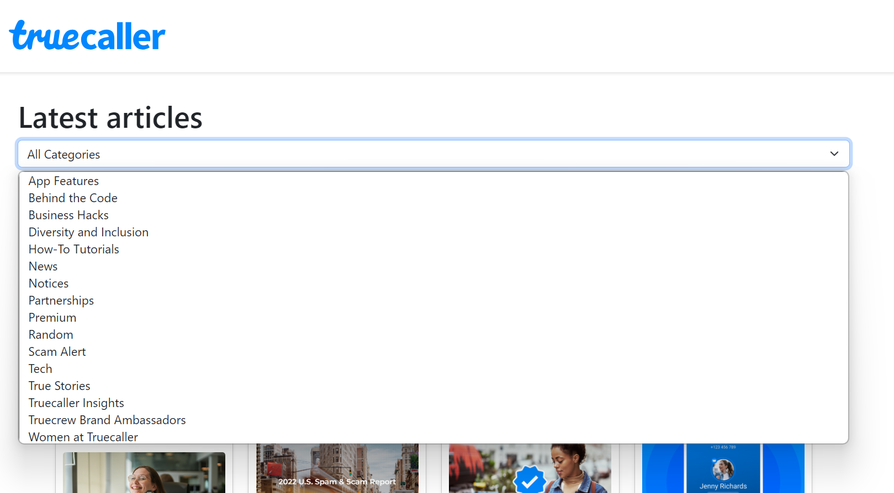
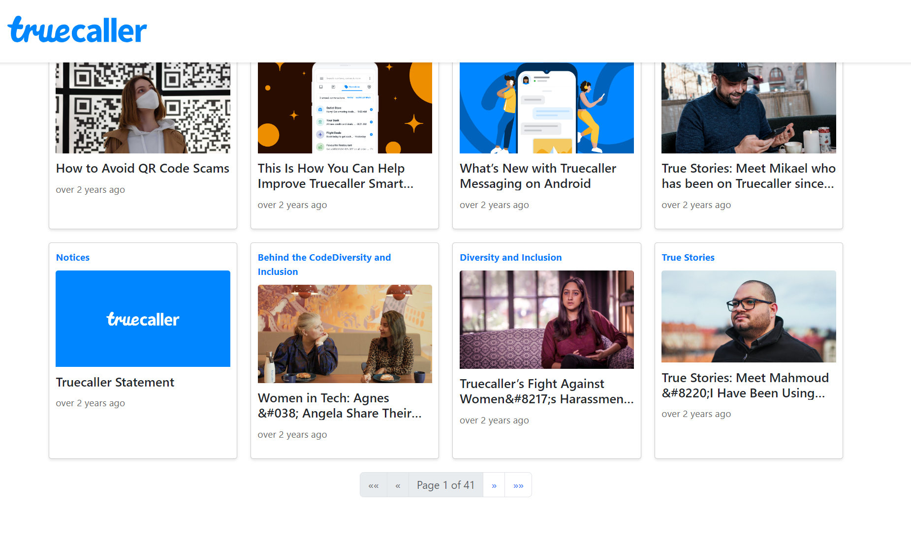
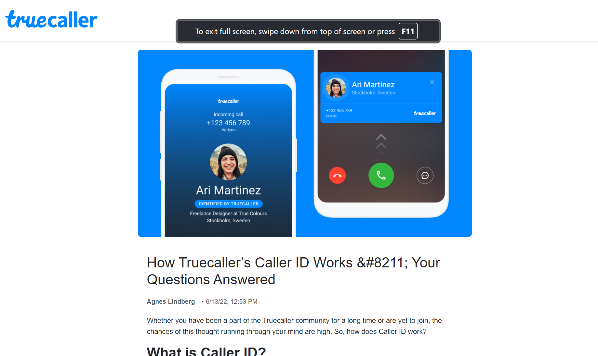
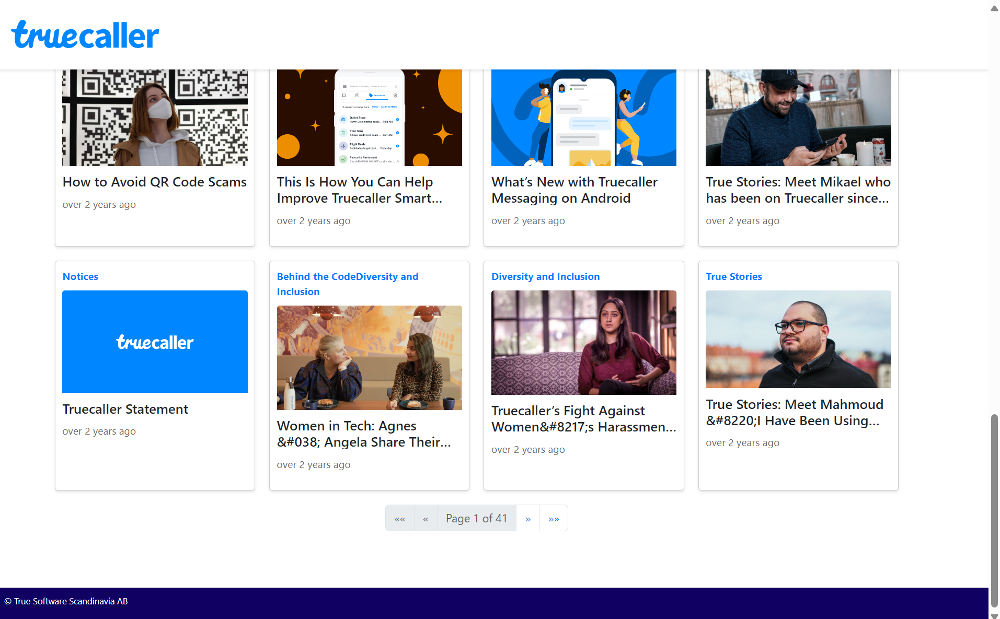

# TruecallerBlog

This project was generated with [Angular CLI](https://github.com/angular/angular-cli) version 17.0.6.

## Description:

This project is a blog application built with Angular. The application fetches and displays blog posts from a WordPress API. Users can browse the latest articles, filter them by categories, and navigate to individual post details.

## Features:

Home Page: Displays a list of the latest blog posts.

Category Filter: Allows users to filter posts by category using a dropdown menu.

Pagination: Supports navigating through pages of posts.

Post Details: Displays detailed information about individual blog posts.

Header and Footer: Includes a fixed header with a logo and a footer with the company name.

## Assumptions and Shortcuts

Standalone Components: The project uses standalone components instead of modules to simplify the structure. This approach reduces boilerplate code and leverages Angular's standalone component feature for better modularity.

API Integration: The WordPress API is used to fetch posts and categories. The API endpoints are assumed to provide the necessary fields (slug, categories, post_thumbnail, title, date) without additional transformations.

Styling: Basic styling is provided using SCSS, and Bootstrap is included for layout and component styling. The focus is on functionality rather than detailed UI/UX design.

Error Handling: Basic error handling is implemented, assuming the API endpoints are reliable and available. Additional error handling and user feedback mechanisms can be added for production readiness.

No External Libraries: The project avoids using external libraries like PrimeNG for simplicity and to reduce dependency management overhead. All components and functionality are implemented using standard Angular features.

## Installation

To run this project locally, follow these steps:

1. **Install dependencies**
    npm install

2. **Start the development server**
    npm start
    Navigate to `http://localhost:4200/`. The application will automatically reload if you change any of the source files.

3. **Build the project**
    ng build
    The build artifacts will be stored in the `dist/` directory.

4. **Run unit tests**
    ng test
    This will execute the unit tests via [Karma](https://karma-runner.github.io).

5. **Run end-to-end tests**
    ng e2e
    This will execute the end-to-end tests via a platform of your choice. To use this command, you need to first add a package that implements end-to-end testing capabilities.